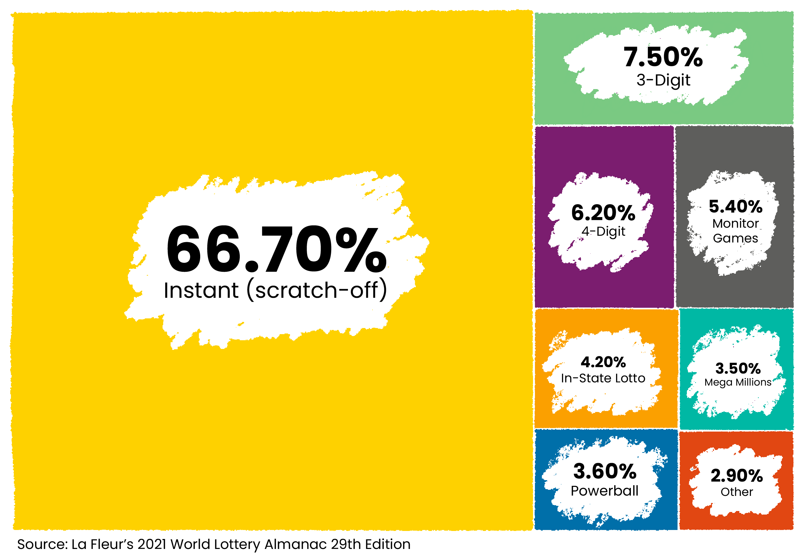
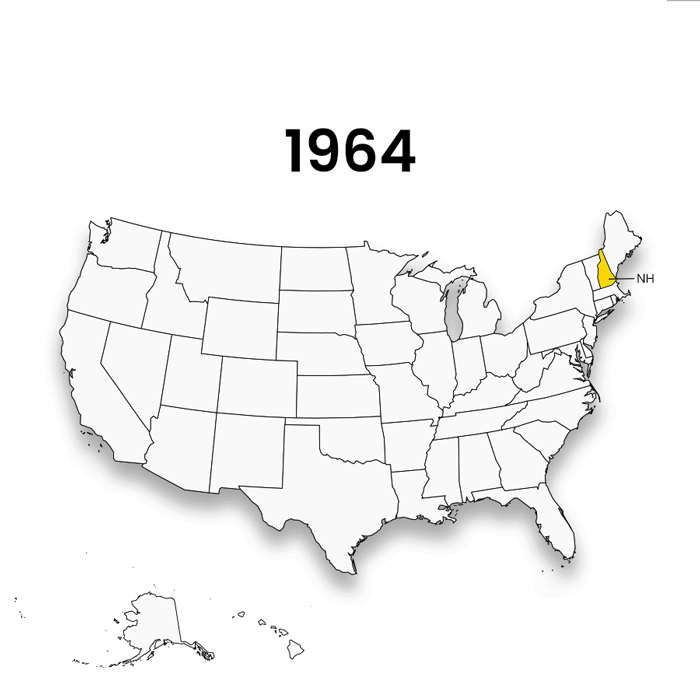

# Mega Billions: The great lottery wealth transfer

Students from the University of Maryland’s Philip Merrill College of Journalism conducted a first-of-its-kind analysis of mobile-phone location data to prove that the majority of customers at lottery retailers come from nearby neighborhoods and, using census data, that those neighborhoods are disproportionately home to Black, Hispanic and lower-income people.

Data visualizations:

<a href="https://cnsmaryland.org/2022/07/01/state-lotteries-transfer-wealth/">State lotteries transfer wealth out of needy communities </a>  

<a href="https://cnsmaryland.org/2022/07/01/state-lotteries-transfer-wealth/">
  <kbd></kbd>
</a>

<a href="https://cnsmaryland.org/2022/07/01/scientific-games-lottery-playbook-succeeded-then-spread/">Scientific Games’ lottery playbook succeeded, then spread </a>  

<a href="https://cnsmaryland.org/2022/07/01/scientific-games-lottery-playbook-succeeded-then-spread/">
  <kbd></kbd>
</a>